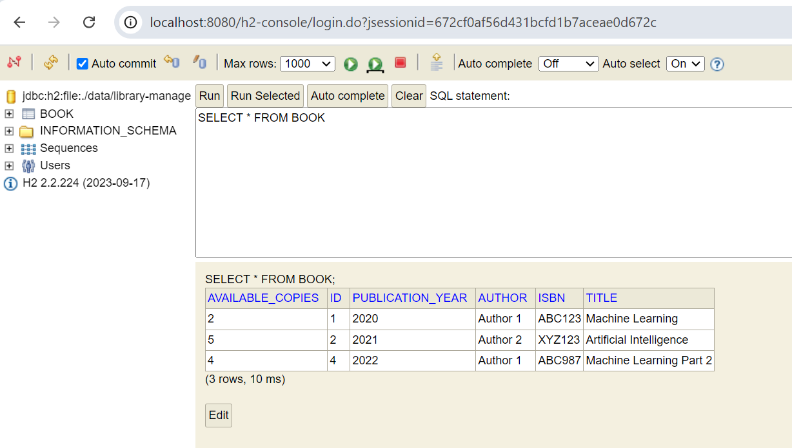
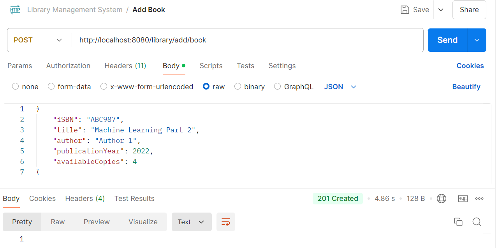
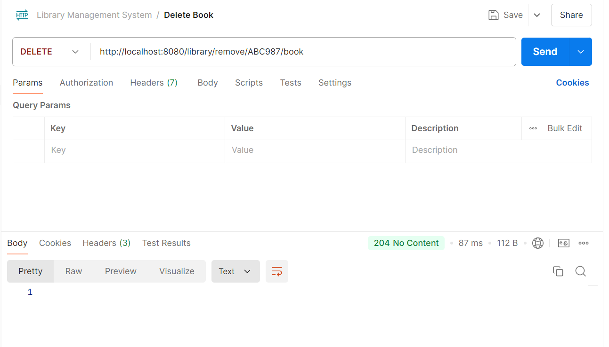
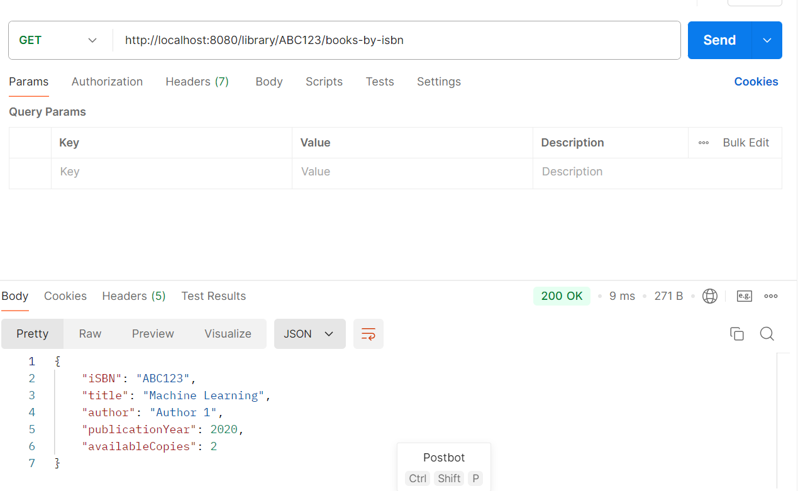
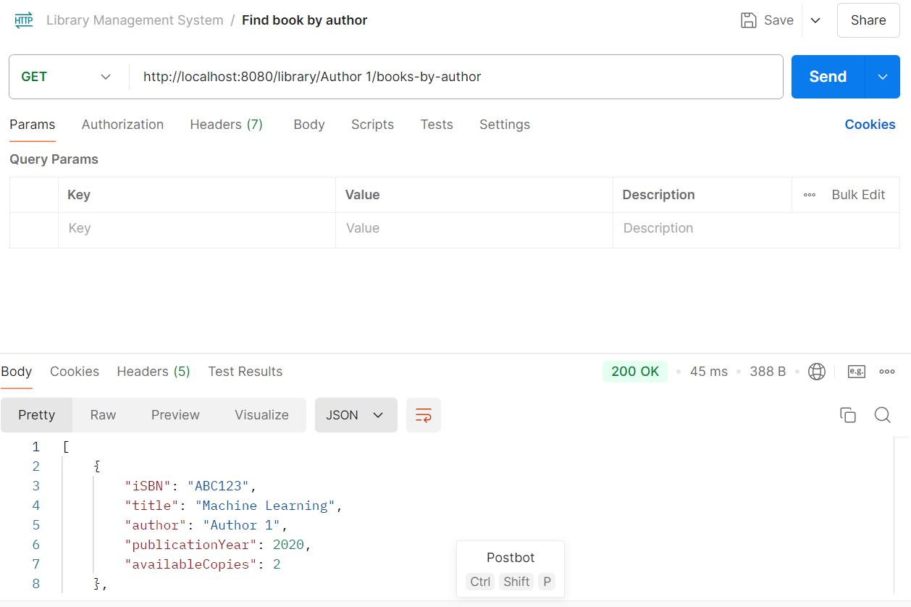
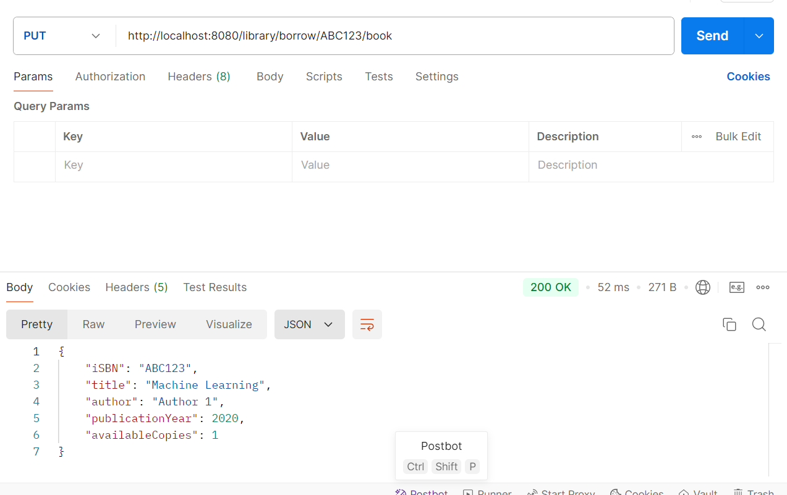
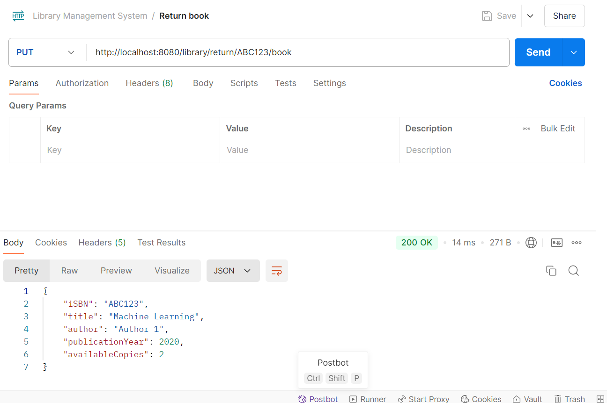
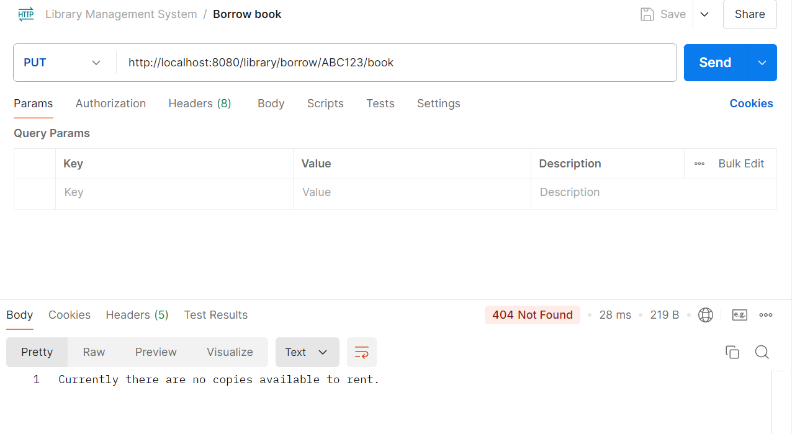
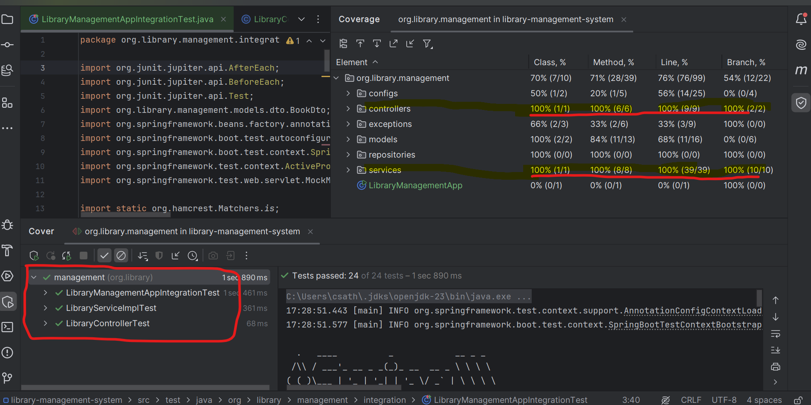
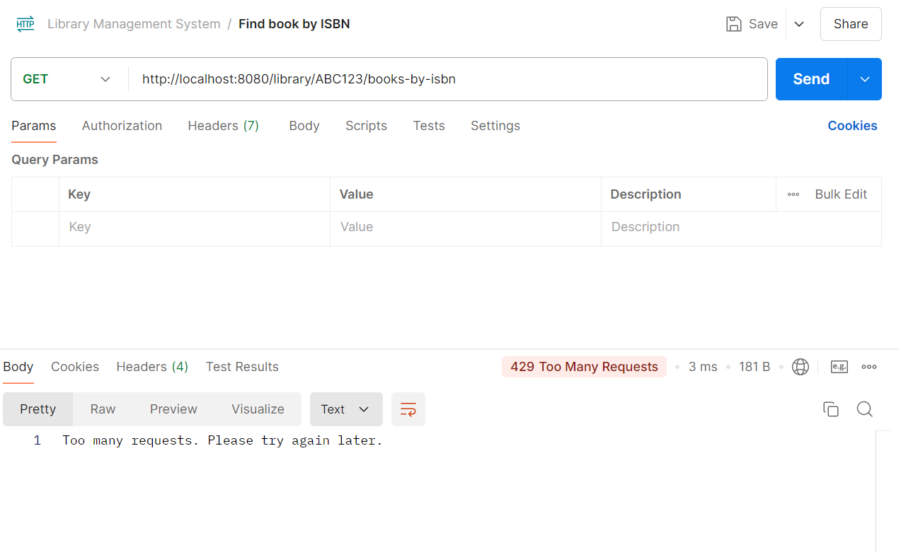

# Library Management System
## Problem statement

  
Expand here for the problem statement / detailed requirement

### Design and implement a `Book` class with the following attributes:
- ISBN (String)
- Title (String)
- Author (String)
- Publication Year (int)
- Available Copies (int)

1. Implement a thread-safe `Library` class that manages a collection of books concurrently. It should have the following methods:
    - `addBook(Book book)`: Adds a new book to the library
    - `removeBook(String isbn)`: Removes a book from the library by ISBN
    - `findBookByISBN(String isbn)`: Returns a book by its ISBN
    - `findBooksByAuthor(String author)`: Returns a list of books by a given author
    - `borrowBook(String isbn)`: Decreases the available copies of a book by 1
    - `returnBook(String isbn)`: Increases the available copies of a book by 1

2. Implement a simple in-memory cache for frequently accessed books to improve performance.

3. Create a RESTful API using Spring Boot (or a framework of your choice) that exposes the Library functionality. Include endpoints for all the operations mentioned above.

4. Implement proper error handling and use appropriate HTTP status codes for different scenarios.

5. Use dependency injection and follow SOLID principles in your design.

6. Implement comprehensive unit and integration tests, aiming for high code coverage.

7. Use Java 8+ features where appropriate (e.g., streams, lambdas, Optional).

## How to run the application:

  
Steps to run the app

This is a simple spring-boot application which can be started by running the `LibraryManagementApp.java`.
When the app starts, the in-memory H2 DB will be seeded with some test data as shown below (Details of which can be found in `SeedData.java`)

The in-memory H2 DB console can be accessed via `http://localhost:8080/h2-console`  and the DB configs can be found under `src/main/resources/application.properties`.

### System Capabilities

This application exposes the following endpoints:
    - `/library/add/book - addBook(BookDto book)`: Adds a new book to the library

    - `/library/remove/{iSBN}/book - removeBook(String isbn)`: Removes a book from the library by ISBN

    - `/library/{iSBN}/books-by-isbn - findBookByISBN(String isbn)`: Returns a book by its ISBN

    - `/library/{author}/books-by-author - findBooksByAuthor(String author)`: Returns a list of books by a given author

    - `/library/borrow/{iSBN}/book -borrowBook(String isbn)`: Decreases the available copies of a book by 1

    - `/library/borrow/{iSBN}/book - returnBook(String isbn)`: Increases the available copies of a book by 1

#### Additional details:
The following features are incorporated to the application:
1) In-mem H2 DB
2) Cache - the GET endpoints results are cached for performance improvement
3) Error Handling - Appropriate error message are shown - for example when the user tries to borrow when no copies are available (refer the screenshot below)
 
4) Added unit test and integration tests, with 100% code coverage for the core functional code (Controller & Service)

4) Implemented rate limit restriction (`using spring-boot-starter-data-redis`) all the endpoints (refer to the screenshot for sample output)
   Currently the rate is set to 5 calls per minute, which can be externalised and configured.
